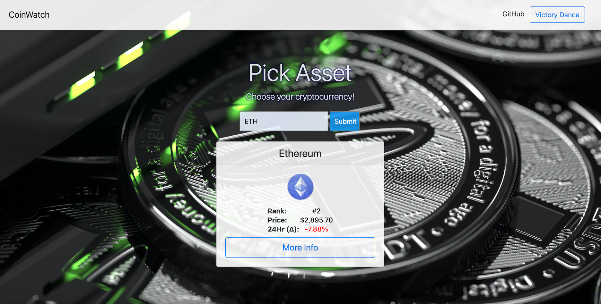

<h1 align="center">Frontend Project: CoinWatcher</h1>

Project Objective: Write an application that accomplishes the minimum requirements below, and looks nicely styled and polished. Complete all features and styling in two days. 

1. PROPOSAL: Approval of proposed project.

2. INTERACTION: Must have at least one event listener.

3. AJAX: Must have at least one AJAX call to an API.

4. DOM: Must manipulate the DOM based on a user’s interaction with your app

5. POLISH: Your application should look clean and finished

6. DEPLOY: Deploy to surge - https://surge.sh/ 

Project Description: Are you invested in Crypto? Do you find yourself going to look at the market price for your investments regularly, but just get tired of all the data noise on most exchanges and coin trackers? CoinWatcher is a simple solution that reduces this noise and with one click gives shows you the three most important factors for your investment: asset rank, asset price (in USD), and the percent change over the last 24 Hrs. Of course, if you find that on that particular day you want to research beyond these three factors, there is a convient link to take you to deep dive to your hearts content. CoinWatch even offers you quick access to the world's best victory dance when you realize you just became a crypto-millionaire. #StayFreeMyFriends.

CoinWatch: https://coin-watcher.surge.sh

### Further Information

APIs: 
1. Bootstrap for styling
2. GoogleAPIs for AJAX
3. Coincap API for current market data
4. International API for formatting data

Construction:

Page Layout: The webpage layout was constructed with HTML and styled with Bootstrap and an additional CSS stylessheet. 

Page Responsiveness: The webpage makes use of AJAX, the DOM, and JavaScript to pull market data from the Coincap API and display in out the webpage when searched for. It makes use of one event listener to respond to a click on the search button as well as the International API to style the data that's returned. When clicked the data pulled from the Coincap API is returned and added to the prior created HTML elements in index.html.
